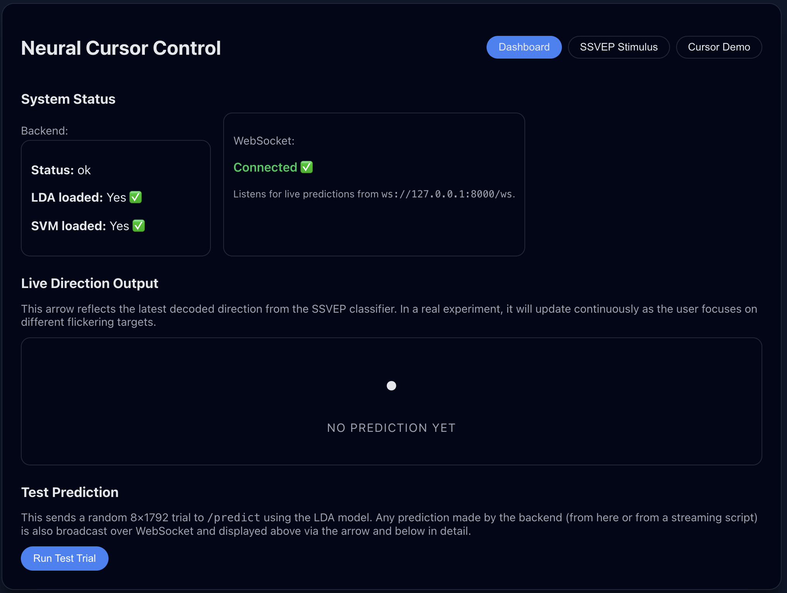
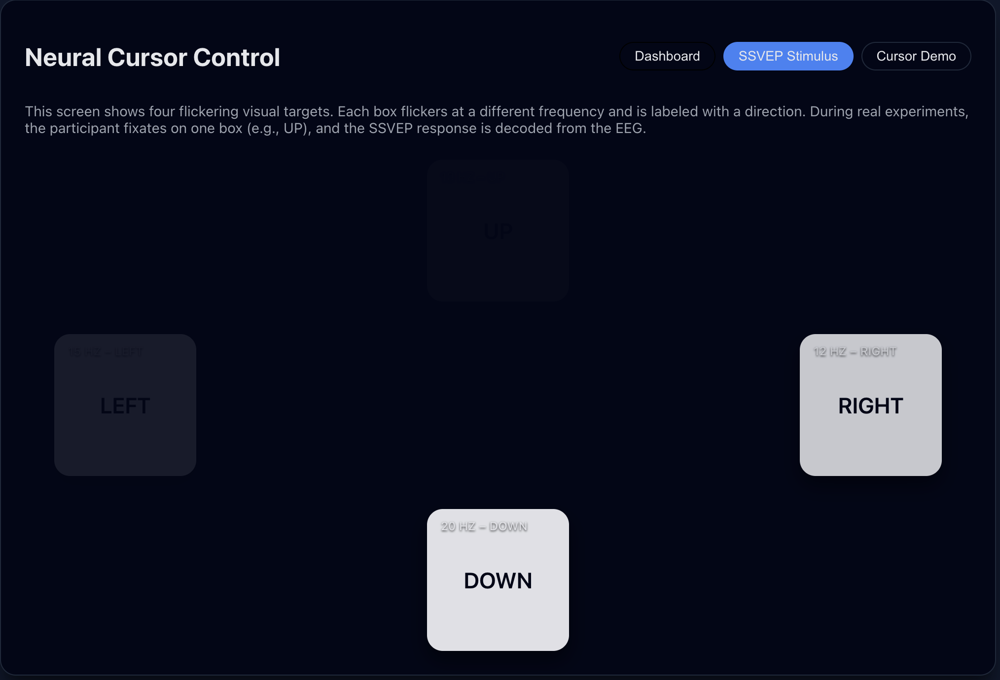
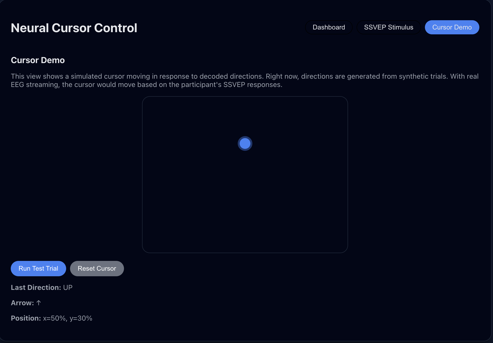

# Neural Cursor Dashboard (Frontend)

The frontend is a **React-based** web interface that serves three main purposes: visualizing backend system health, presenting SSVEP visual stimuli to the user, and demonstrating real-time cursor control.

## Tech Stack
* **Framework:** React (Create-React-App)
* **Networking:** Fetch API & WebSockets (for backend communication)
* **Styling:** CSS / Inline Styles

## Setup & Run

1.  Navigate to the frontend directory:
    ```bash
    cd frontend
    ```
2.  Install dependencies:
    ```bash
    npm install
    ```
3.  Start the development server:
    ```bash
    npm start
    ```
4.  Open [http://localhost:3000](http://localhost:3000) in your browser.

## Features & Tabs

The UI is organized into three main tabs:

### 1. Dashboard
The control center for the system.
* **Health Status:** Displays the current connection status of the Backend API and WebSocket stream.
* **Test Integration:** Includes a **"Run Test Trial"** button that:
    1.  Generates a synthetic 8×1792 EEG trial directly in the browser.
    2.  Sends it to the backend `/predict` endpoint.
    3.  Displays the returned classification (Up/Down/Left/Right), confidence probabilities, and a directional arrow.



### 2. SSVEP Stimulus
The visual presentation layer for data collection.
* **Layout:** Displays four flickering boxes arranged spatially:
    * **UP** (Top)
    * **DOWN** (Bottom)
    * **LEFT** (Left)
    * **RIGHT** (Right)
* **Frequencies:** Each target flickers at a specific frequency (approx. 10, 12, 15, and 20 Hz) to evoke distinct SSVEP responses in the user's visual cortex.



### 3. Cursor Demo
A functional demonstration of the decoded commands controlling an interface.
* **Visuals:** Shows a bounded area with a glowing cursor dot.
* **Logic:** The cursor updates its position relative to the center whenever a new directional command is received.
* **Controls:**
    * **"Run Test Trial (Backend)":** Triggers a prediction via the actual API to move the cursor.
    * **"Simulate Random Direction":** Frontend-only simulation to test cursor physics without the backend.
    * **"Reset Cursor":** Instantly re-centers the cursor.


